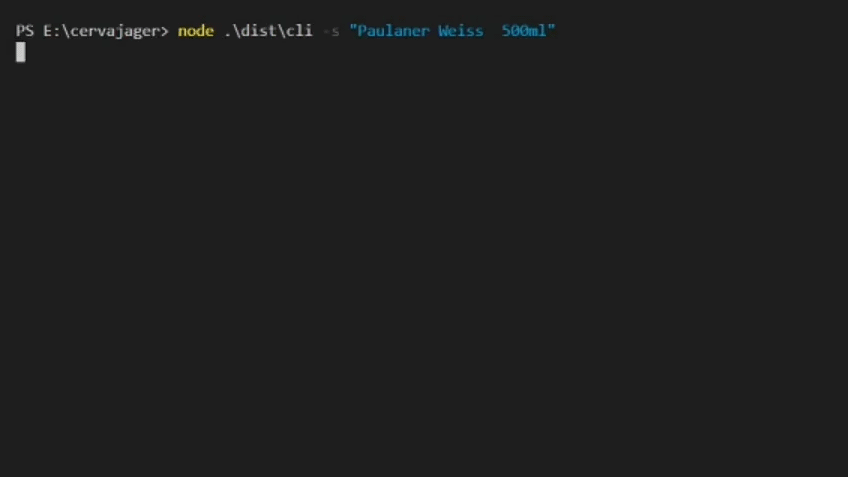

# CervaJäger

[](https://travis-ci.org/arturfigueira/cervajager)

[](https://codecov.io/gh/arturfigueira/cervajager)

Searching for beers sometimes can be a hassle, browsing each beer's web store, for the best price it's time consuming and sometimes confusing. Even though We have access to google shopping and similar, small beer's stores and importers are usually not available at those indexers.

CervaJäger is a module that contains only the backbone for other applications, and will provide methods to register data sources, search, organize and return the best matches for the desired beer. The main purpose of this module is searching web sources, via scraping. However, the module is generic in a way that other types of data sources (spreadsheets, rest api,...) can be implemented and plugin in into the final application.

_This module has no association with any beer, brewery, or Web Store. Its purpose is not commercial, by any means, it's a personal project with the intention to help me finding the best beer prices out there. Prost!_

## Table of Contents

- [CervaJäger](#cervajäger)
  - [Table of Contents](#table-of-contents)
  - [Instalation](#instalation)
    - [Installing from release or source code](#installing-from-release-or-source-code)
    - [Installing from github packages](#installing-from-github-packages)
  - [Example of Usage](#example-of-usage)
  - [API](#api)
    - [Scraper.byName(string)](#scraperbynamestring)
  - [Plugins](#plugins)
  - [Name Matching](#name-matching)
  - [Contributing](#contributing)
  - [License](#license)

## Instalation

Pre-Requisites:

- It`s required at least [NodeJs](https://nodejs.org/en/) version 14.x
- At least 400mb of space, as it will use an embedded chromium

The modulo is not available at NPM. You have three options at the moment, depending on how you`d to use the module:

1. Download the [last released version](https://github.com/arturfigueira/cervajager/tags);
2. Checkout the source code, from this repo, and install it;
3. Download the npm package from github packages. _Refer to this [guide](https://docs.github.com/pt/packages/guides/configuring-npm-for-use-with-github-packages#installing-a-package) for more info on how to configure Github as a npm registry_.

### Installing from release or source code

```bash
cd <checkout_folder>
npm install
npm run build
```

A [`companion CLI`](src/cli/index.ts) is also available, and can be used to evaluate the module. A sample processor and data is packed together, as an example of the module's capabilities.

```bash
cd <checkout_folder>/dist
node ./cli -s "beer name"
```



### Installing from github packages

```bash
npm i @arturfigueira/cervajager
```

## Example of Usage

```typescript
import { Scraper, DamerauMatcher } from "@arturfigueira/cervajager";
import {
  SamplerProcessor,
  WebScraper,
  ScraperEngine,
} from "@arturfigueira/cervajager";

const searchTerm = "Straffe Hendrik Heritage 2013";

//Fuzzy Naming matching to filter results. Optional
const matcher = new DamerauMatcher(80);

//Initialize a new Web Scraper plugin.
const webScraperPlugin = new WebScraper(new SamplerProcessor());

//List of data sources to search for the specified term
const sources = [webScraperPlugin];

//Initialize the scraper
const scraper = new Scraper(sources);

//Search and display the resultant list of beers
scraper
  .byName(searchTerm)
  .then((result) => {
    console.log(result.scrapedBeers); //ordered by price, ascending
  })
  .catch((err) => {
    console.log(err.message);
  })
  .finally(() => ScraperEngine.halt());
```

## API

### Scraper.byName(string)

Search given beer name at all registered data sources.
Errors during the search will be suppressed and won't halt the search process.

Returns a promise that will resolve into an object that contain a list of found beers, and a list of errors, identified per source. Both lists can be empty, and won't be null.

## Plugins

This module works with the idea of plugins, that can be developed to extend the reach of search. All plugins should implement the interface [`sourceScraper`](src/core/sourceScraper.ts).

A [`WebScraper`](src/plugins/scrapers/web/webScraper.ts) plugin is available OOTB, however each web page has its particularities. To deal with it a [`scrapeProcessor`](src/plugins/scrapers/web/scrapProcessor.ts) is available to be implemented for each web store that will be searched. The scrape processor will be responsible to process and extract the list of found beers, from the web page.

```typescript
import { Scraper } from "./core";
import { WebScraper } from "./plugins/scrapers/web";
const myWebStoreProcessor: ScrapProcessor = new CustomWebStoreProcessor();
const webScraper = new WebScraper(myWebStoreProcessor);
const scraper = new Scraper([webScraper]);
```

## Name Matching

When searching for a term a mix bag of results might be returned from the data sources. Each source may deal with a search into different approaches, some may return results even when the searched beer is not found, some may return the found beer with a list of similar beers, others may return the exact match. To help filtering those results a [`NameMatcher`](src/core/matcher/nameMatcher.ts) interface is also available and can be loaded into the [`WebScraper`](src/plugins/scrapers/web/webScraper.ts) plugin. Name matching is optional for the WebScraper, if not presented no filtering will be applied and all results found will be returned.

A matcher, using a [`Damerau-Levensthein`](src/core/matcher/damerauMatcher.ts) distance algorithm, to calculate terms similarities, is available out of the box.

```typescript
import { DamerauMatcher } from "./core/matcher";

//Ratio of 80%. Will consider a match if both terms have at least 80% of similarity, based on damerau algorithm
const matcher = new DamerauMatcher(80);
matcher.matches("TermA", "TermB");
```

## Contributing

Fell free to contribute, suggest optimizations or new features. But before getting your hands dirty, please take a minute and read this [guidelines](CONTRIBUTING.md).

## License

This project is licensed under the GNU GENERAL PUBLIC LICENSE - see the [LICENSE.md](LICENSE) file for details.
